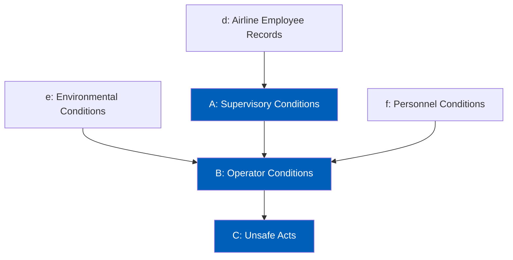

# Sequential Causal Architecture for Multimodal Aviation Accident Prediction

Aviation accidents cannot be attributed to a single failure, but rather a causal chain of failures. Many accident investigators use causal theoretical frameworks such as the Swiss Cheese Model, SHELL model, and FAA's HFACS to assist them in understanding the entire accident sequence. Notably, the Swiss Cheese model argues that the causal chain can be modeled by organizational influences, supervisory conditions, preconditions, then unsafe acts. Many data mining prediction models attempt to predict what happened rather than how it happened. For this project, we propose to implement a structured data mining approach by transforming causation models into a directed acyclic graph for multi-stage prediction. 

## Project Structure

```
├── data/               # Cleaned Dataset
├── models/
│   ├── random_forest/  # Classical Machine Learning
│   ├── bayesian_net/   # Classical Machine Learning
│   └── lstm/           # Deep Learning
├── notebooks/          # Exploratory Data Analysis
└── README.md
```

## Causal Architecture

The following diagram illustrates the structural flow of our prediction model with nodes being colored in blue being predicted variables at some point. To maintain a rigorous causal structure, this model adheres to a strict Direct Parent Dependency rule. Each node in the sequence is predicted only by its immediate incoming connections.



## Dataset

Data Sources
- **NTSB Accident Database:** 
- **NTSB Recommendation Database:**
- **Employment:**

Data Attributes
- Accident ID: Nominal (ID)
  - Record ID
- Employment Records: Numeric (%)
  - Employment Change vs Prior Period 
- Light Conditions: Nominal 
- Basic Meterological Conditions: Nominal
  - IMC
  - VMC
- Wind Conditions: Numeric (Raw)
- Temperature: Numerical (Raw)
- Personnel Conditions: Nominal
  - Crew Resource Management
  - Personal Readiness
- Supervisory Conditions: Nominal
  - Inadequate Supervision
  - Planned Inappropriate Operations
  - Failed to Correct Known Problem
  - Supervisory Violations
- Operator Conditions: Nominal
  - Adverse Mental State
  - Adverse Physiological State
  - Physical Limitations
  - Mental Limitations
- Unsafe Conditions: Nominal
  - Decision Errors
  - Skill-based Errors
  - Perceptual Errors
  - Routine Violations
  - Exceptional Violations

## Evaluation

We will be comparing performance across three different data mining methods, both classical and deep learning methods. This includes random forest, bayesian network, and LSTM network. We will be using the following to analyze each of their performance:
- Accuracy
- Weighted F1-score (weighted more towards recall)
- Confusion Matrix
- Feature Importance Analysis (SHAP)
- Sensitivity Analysis
- Statistical Analysis

## Requirements
