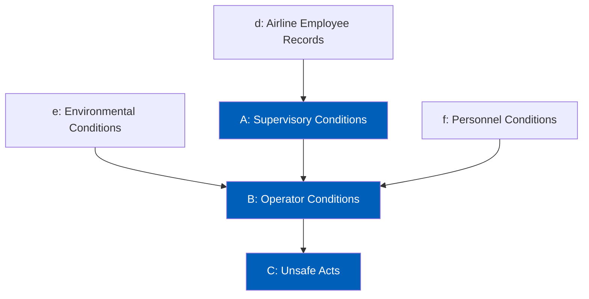

# Sequential Causal Architecture for Multimodal Aviation Accident Prediction

Aviation accidents cannot be attributed to a single failure, but rather a causal chain of failures. Many accident investigators use causal theoretical frameworks such as the Swiss Cheese Model, SHELL model, and FAA's HFACS to assist them in understanding the entire accident sequence. Notably, the Swiss Cheese model argues that the causal chain can be modeled by organizational influences, supervisory conditions, preconditions, then unsafe acts. Many data mining prediction models attempt to predict what happened rather than how it happened. For this project, we propose to implement a structured data mining approach by transforming causation models into a directed acyclic graph for multi-stage prediction. 

## Project Structure

```
├── data/               # Cleaned Dataset
├── models/
│   ├── random_forest/  # Classical Machine Learning
│   ├── bayesian_net/   # Classical Machine Learning
│   └── lstm/           # Deep Learning
├── notebooks/          # Exploratory Data Analysis
└── README.md
```

## Causal Architecture

The following diagram illustrates the structural flow of our prediction model with nodes being colored in blue being predicted variables at some point. To maintain a rigorous causal structure, this model adheres to a strict Direct Parent Dependency rule. Each node in the sequence is predicted only by its immediate incoming connections.


## Requirements
